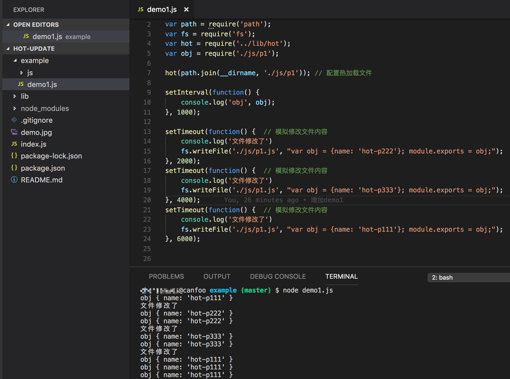

#hot-update

Node 模块热加载工具

> 平常在开发nodejs，如果修改代码了，需要重启node进程才可以进行验证，这样大大降低了开发效率。虽然现在有一些工具可以配置nodejs文件修改后自动重启进程，但是针对一些比较复杂nodejs代码，比如代码有监听端口功能，重启进程也是一个比较久时间的消耗。开发阶段如果可以只针对某个改变nodejs文件进行重加载，这样就可以节省不必要的等候时间了。hot-update正是这样的工具：

[一个例子](https://github.com/canfoo/hot-update/blob/master/example/demo1.js)：




## 如何使用

安装

```
npm install -D module-hot-update
```

配置（就是这么简单～）

```javascript
var hotUpdate = require('module-hot-update');
var path = require('path');

/* path 为需要监听文件的相对路径
   支持两种格式：String or Array
   如果为String，可以为路径具体位置，或者某个目录
   如果为Array，则数组的每一项为某个文件的具体位置
*/
hotUpdate(path.join(__dirname, path); 
          
```


## 注意


目前只能对模块导出的内容是Object和Array类型的进行热加载

## TODO

